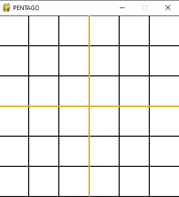
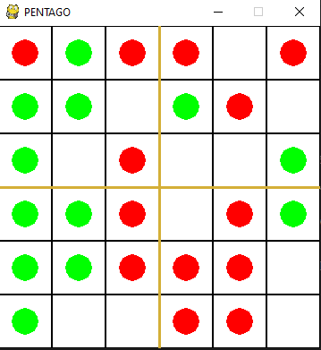
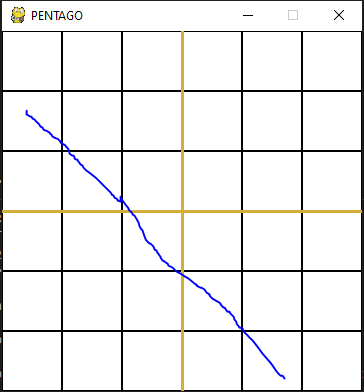
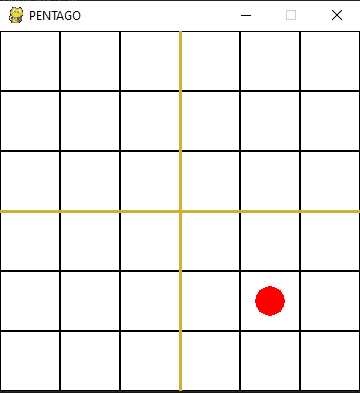

# PENTAGO

## Introduction

It's a 1v1 game where the player with best strategy wins



The game is played on a 6x6 board divided in 4 3x3 sub-boards.


In this game, you'll control where you want to piece your marbles each turn and also choose the sub-board that they want to rotate either clockwise or anti-clockwise.

Every turn, you get to see the state of the entire board.

## Gameplay

### Goal

The goal of the game is to get five of their marbles consequetively in a vertical, horizontal or diagonal row (after rotation of the subrow)



In the image above, the green marble wins because it has 5 consecutive marbles in the first column


#### Note: 
There are 4 diagonals with 5 values in them. If 5 marbles are placed consequetively there also, a player wins. An example of one such diagonal is:



### Percepts

At each game step, you'll be provided with the current state of the board ie: The current orientation of the board.

For example:
Initally, player 1 will see:


And after this, when it's the turn of player 2, he'll see:



### Action

In the bot's step function, you must accept an arguement for state (which is the current state of the board) and return an action

The action is an array consisting of 4 elements of type int. 

The action must be an array as follows:
```python
[
  x, # The x-coordinate where you want to place your marble
  y, # The y-coordinate where you want to place your marble
  sub-board,
  '''
  The sub-board/quadrant that you want to rotate It should be a value in [1,2,3,4]
    1 refers to the sub-board [:3, :3]
    2 refers to the sub-board [:3, 3:]
    3 refers to the sub-board [3: ,:3]
    4 refers to the sub-board [3:, 3:]
  where the first slicing referes to the row and the second slicing refers to the columns
  '''
  rotation # It represent whether you want to rotate the board clockwise(-1) or anticlockwise (1)
]
```

An example action would be:
``` python
  [3,4,2,-1]
'''
This means that the marble will be placed in the coordinate (3,4) and the 2nd quadrant will be rotated in the clockwise direction
'''
```

### Turn Mechanics

Assume there are 2 players (player 0,1). Player 0 moves first and then player 1. This completes one round of play. After this, the game continues in the same order ie: player 0 -> 1 -> 0 -> 1 and so on.

Every turn, you are provided with percepts (current state of the board)

## Bot class

Required functions: 
``` python
def __init__(self):
    pass

def step(self,state):
    pass
```

## Running the files

To run the program for the first time, run the pentago.py file.

This will create a history.hbd file.

Next, run the betaTestGame.py file to view the game. While doing so, you have to click on the pygame window everytime you want to see the next turn being played.

I have provided a random agent as a baseline. This can be found inside pentago.py

```python 
from yourFile import yourAgent
```

Now, add your agent class into the agent_classes array in line 187.

```python
env = Pentago(BOARD_SIZE,[yourAgent(), randomAgent()], 'history.hbd')
```